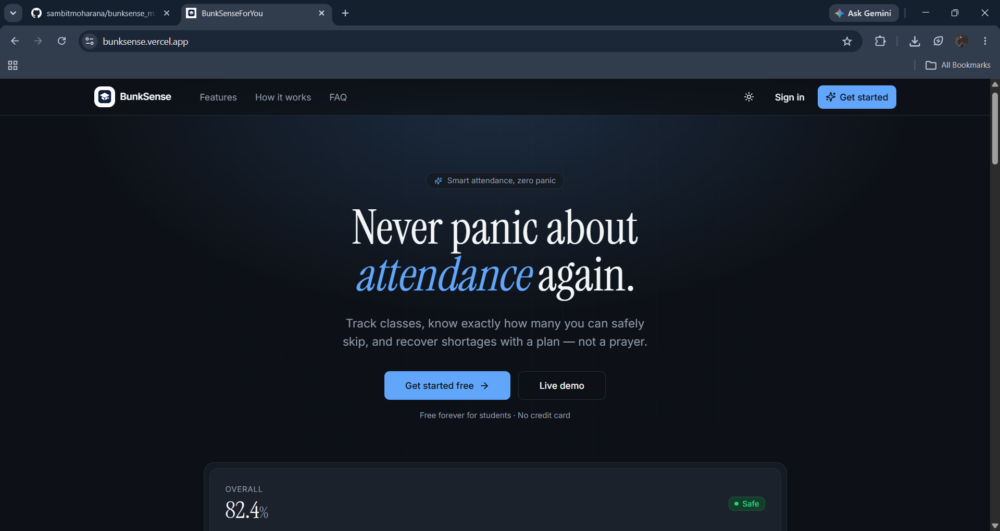
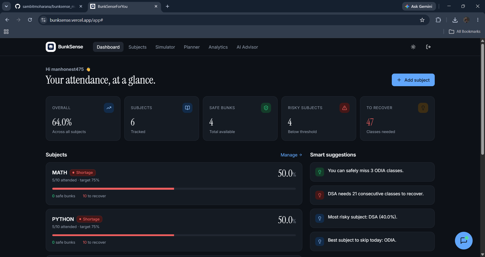
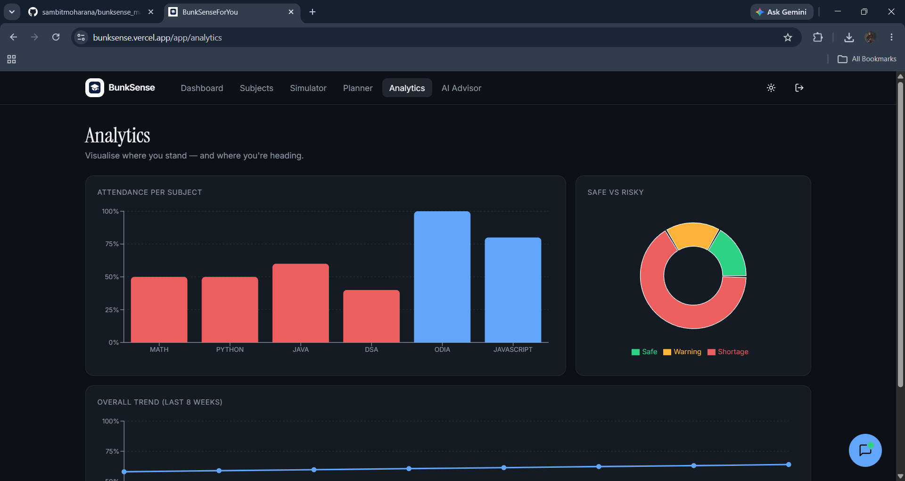

# 🎓 BunkSense

> "I stopped tracking attendance in spreadsheets. BunkSense just tells me."


BunkSense is an AI-powered attendance management platform built for students who want to stay on top of their attendance without the hassle of manual calculations. Track attendance, predict risks, plan bunks, receive AI-powered guidance, and make smarter academic decisions all from a single dashboard.
Designed to replace tedious spreadsheets, BunkSense makes it effortless for students to monitor their class attendance, calculate percentages, and plan their bunks perfectly! 🚀

## ✨ Features

### 🔐 Authentication & Security
- Secure Google OAuth authentication
- Email/Password authentication powered by Supabase
- Protected user data and cloud synchronization

### 📊 Attendance Management
- Add and manage subjects effortlessly
- Track Present, Absent, and Cancelled classes
- Real-time attendance percentage calculations
- Subject-wise and overall attendance monitoring

### 🎯 Attendance Risk Prediction
- Automatically predicts attendance risks
- Identifies subjects approaching critical attendance thresholds
- Provides early warnings before attendance falls below requirements

### 🤖 AI Academic Advisor
- Ask attendance-related questions in natural language
- Get personalized recommendations based on your attendance data
- Example questions:
  - "Can I bunk tomorrow's DBMS class?"
  - "Which subject is most at risk?"
  - "How many classes should I attend this week?"
  - "What is my safest subject to miss?"

### 📈 AI Weekly Insights
- AI-generated attendance summaries
- Weekly performance analysis
- Attendance trend tracking
- Personalized recommendations to improve attendance

### 📊 Analytics Dashboard
- Interactive attendance charts
- Subject-wise performance visualization
- Attendance trend analysis
- Clean and intuitive dashboard interface

### 📱 Responsive Design
- Optimized for Desktop
- Tablet-friendly experience
- Mobile-responsive design

### ⚡ Performance
- Fast and lightweight
- Modern React architecture
- Optimized user experience


## 🛠️ Tech Stack & Tools Used

BunkSense is built entirely using a modern frontend stack with a robust backend-as-a-service.

### Frontend
- ⚛️ **React** - UI library (v18)
- ⚡ **Vite** - Lightning-fast build tool and development server
- 📘 **TypeScript** - For type-safe and reliable code
- 🎨 **Tailwind CSS** - Utility-first CSS framework for beautiful styling
- 🧱 **shadcn/ui & Radix UI** - Accessible, unstyled, and customizable UI components
- 📈 **Recharts** - For beautiful, responsive charts and analytics
- 📝 **React Hook Form & Zod** - Form handling and schema validation
- 🔔 **Sonner** - Toast notifications
- 📅 **date-fns** - Modern JavaScript date utility library
- 🗺️ **React Router** - Client-side routing

### Backend & Deployment
- 🟢 **Supabase** - Authentication & Database
- ▲ **Vercel** - Cloud platform for frictionless deployment

### AI Integration
- 🤖 Google Gemini API
- 🧠 Context-aware attendance recommendations
- 📈 AI-generated weekly attendance insights

## ⚙️ How It Works

### 1️⃣ Create Your Account
Sign in using Google OAuth or Email/Password authentication.

### 2️⃣ Add Your Subjects
Enter your subjects and define the minimum attendance requirement.

### 3️⃣ Track Attendance
Update attendance with a single click by marking classes as:
- Present
- Absent
- Cancelled

### 4️⃣ Analyze Performance
View:
- Overall attendance percentage
- Subject-wise attendance
- Attendance trends
- Risk indicators

### 5️⃣ Plan Your Bunks
Use the built-in attendance simulator to determine:
- Safe bunks remaining
- Required classes to attend
- Impact of future absences

### 6️⃣ Ask BunkSense AI
Interact with the AI Academic Advisor to receive personalized guidance based on your attendance records.

### 7️⃣ Review Weekly Insights
Receive AI-generated summaries and recommendations to stay academically on track.

## 🚀 Installation Process

If you want to view the UI and layout locally:

1. **Clone the repository:**
   ```bash
   git clone https://github.com/sambitmoharana/bunksense_makessense.git
   cd bunksense_makessense
   ```

2. **Install dependencies:**
   ```bash
   npm install
   ```

3. **Run the development server:**
   ```bash
   npm run dev
   ```

*(Note: Certain features like database syncing and authentication are securely locked behind private environment variables and will not function without the original backend configuration.)*

## 🔮 Future Improvements

- [ ] Support for timetable integration and automatic subject scheduling.
- [ ] Push notifications to remind users to update their daily attendance.
- [ ] Advanced dark mode customization and theming.
- [ ] Multi-semester tracking and historical GPA correlation.

## 🔗 Live Demo

Check out the live application here:  
**[https://bunksense.vercel.app](https://bunksense.vercel.app)**

## 📸 Screenshots

### Home Page


### Dashboard


### Analytics


## ⭐ Why BunkSense?

Most attendance trackers only record data.

**BunkSense goes further.**

It helps students understand their attendance, predict risks, plan bunks strategically, and receive AI-powered academic guidance—turning attendance tracking into intelligent decision-making.

## 👨‍💻 Author

Created by **Sambit Moharana**
